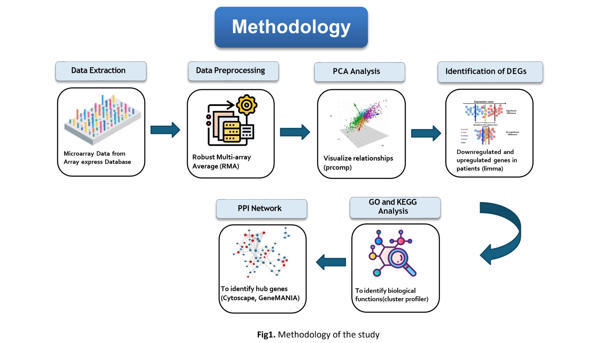

# Microarray Gene Expression Analysis for Breast Cancer (TNBC) and Ovarian Cancer

## Project Overview
This project performs an end-to-end analysis of microarray gene expression data for Triple Negative Breast Cancer (TNBC) across different tumor grades (Grade 0, 2, and 3) and Ovarian Cancer. The analysis includes data preprocessing, differential gene expression (DEG) identification, visualization (e.g., volcano plots, heatmaps), protein-protein interaction (PPI) networks, and pathway enrichment analysis using Gene Ontology (GO) and KEGG pathways.

The datasets are sourced from GEO (e.g., E-GEOD-76250 for breast cancer and E-GEOD-26712 for ovarian cancer). The goal is to identify DEGs, hub genes, and enriched pathways to understand molecular differences in cancer progression.

**Key Focus Areas:**
- Comparison of TNBC vs. Normal breast tissue for different grades.
- Ovarian cancer vs. Control.
- Overlap analysis and pathway enrichment for common genes.

## Methodology
The project follows a structured pipeline as illustrated in the methodology diagram (`methodology.png`):



1. **Data Extraction**: Load raw microarray data (.CEL files) and metadata from GEO datasets.
2. **Data Preprocessing**: Quality control (boxplots, histograms, density plots), normalization (RMA), probe annotation, and filtering (e.g., remove duplicates, low-expression genes).
3. **PCA Analysis**: Principal Component Analysis to visualize sample clustering and batch effects.
4. **Identification of DEGs**: Use Limma for differential expression analysis (logFC > 1, adj.P.Val < 0.05). Generate volcano plots and heatmaps.
5. **PPI Network**: Construct Protein-Protein Interaction networks (not explicitly scripted here but referenced in outputs; tools like STRING or Cytoscape may be used externally).
6. **GO and KEGG Analysis**: Perform Gene Set Enrichment Analysis (GSEA) using clusterProfiler for pathway enrichment.

Outputs include filtered DEG lists, visualizations (PDFs/CSVs), and enrichment results.

## Directory Structure
```
project_root/
├── data_2/                  # Raw .CEL files and metadata for breast cancer (E-GEOD-76250)
├── data_6/                  # Raw .CEL files and metadata for ovarian cancer (E-GEOD-26712)
├── outputs/                 # Generated results (CSVs, PDFs for DEGs, heatmaps, volcano plots, pathways)
│   ├── grade_0/             # Outputs for Grade 0 TNBC
│   ├── grade_2/             # Outputs for Grade 2 TNBC
│   ├── grade_3/             # Outputs for Grade 3 TNBC
│   ├── ovarian/             # Outputs for Ovarian Cancer
│   ├── logfc_output/        # Filtered DEG results after logFC filtering
│   ├── overlapped/          # Common genes across grades
│   ├── pathway_output/      # GO/KEGG enrichment results
│   └── ppi_interactions/    # Hub genes from PPI networks
├── logfc_filter.R           # Script for logFC filtering and visualizations across grades/ovarian
├── ovarian.R                # Full analysis pipeline for ovarian cancer
├── grade_0.R                # Full analysis pipeline for Grade 0 TNBC
├── grade_2.R                # Full analysis pipeline for Grade 2 TNBC
├── grade_3.R                # Full analysis pipeline for Grade 3 TNBC
├── pathway_0.R              # Pathway enrichment for Grade 0 or overlapped genes
├── pathway_2.R              # Pathway enrichment for Grade 2
├── pathway_3.R              # Pathway enrichment for Grade 3
├── prepration_2.R           # Data preparation (e.g., hub gene extraction, combining datasets)
├── methodology.png          # Diagram of the analysis workflow
└── README.md                # This file
```

## Requirements
- **R Version**: 4.0+ recommended.
- **Bioconductor Packages** (install via `BiocManager::install()`):
  - affy, oligo, limma, Biobase, GEOquery, annotate, pd.hta.2.0, hta20transcriptcluster.db, hgu133a.db, pd.hg.u133a.
- **CRAN Packages** (install via `install.packages()`):
  - ggplot2, pheatmap, stringr, data.table, tidyverse (includes dplyr, tidyr, etc.), RColorBrewer, clusterProfiler, org.Hs.eg.db, ggupset, DOSE, enrichplot, readxl.
- **Data Dependencies**: Raw .CEL files and SDRF metadata must be placed in the respective `data_2/` and `data_6/` directories. Download from GEO if not present.
- **Hardware**: Sufficient RAM (at least 8GB) for large microarray datasets.

To install all dependencies:
```r
# Install BiocManager if needed
if (!requireNamespace("BiocManager", quietly = TRUE)) install.packages("BiocManager")

# Bioconductor packages
BiocManager::install(c("affy", "oligo", "limma", "Biobase", "GEOquery", "annotate", "pd.hta.2.0", "hta20transcriptcluster.db", "hgu133a.db", "pd.hg.u133a", "clusterProfiler", "org.Hs.eg.db", "DOSE", "enrichplot"))

# CRAN packages
install.packages(c("ggplot2", "pheatmap", "stringr", "data.table", "tidyverse", "RColorBrewer", "ggupset", "readxl"))
```

## How to Run
1. **Set Up Paths**: Update file paths in scripts to match your local directory (e.g., `setwd("D:/study/lab_projects/Dr_Zubair/Breast _cancer/practice_practical/Selected Datasets/...")`).
2. **Run Grade-Specific Analyses**:
   - For Grade 0 TNBC: `source("grade_0.R")`
   - For Grade 2 TNBC: `source("grade_2.R")`
   - For Grade 3 TNBC: `source("grade_3.R")`
   - For Ovarian Cancer: `source("ovarian.R")`
3. **Apply LogFC Filtering**: Run `source("logfc_filter.R")` to filter DEGs and generate visualizations (volcano plots, heatmaps).
4. **Pathway Enrichment**:
   - For Grade 0/overlapped: `source("pathway_0.R")`
   - For Grade 2: `source("pathway_2.R")`
   - For Grade 3: `source("pathway_3.R")`
5. **Data Preparation (Optional)**: Run `source("prepration_2.R")` for hub gene extraction and dataset merging.
6. **Outputs**: Results are saved in the `outputs/` subdirectories (e.g., CSVs for DEGs, PDFs for plots).

**Notes**:
- Scripts assume data is in specific paths; adjust as needed.
- Some steps (e.g., PPI networks) may require external tools like STRING or Cytoscape for full visualization.
- Large datasets may cause memory issues; process in batches if needed.
- For troubleshooting: Check console output for errors (e.g., missing packages or paths).

## Results Interpretation
- **DEGs**: Filtered lists in `outputs/logfc_output/` (e.g., `filtered_Grade_0_TNBC_DEG_results.csv`).
- **Visualizations**: Volcano plots and heatmaps in PDF format.
- **Pathways**: GO/KEGG results in CSVs (e.g., `Grade_2_gse_go_results.csv`).
- **Hub Genes**: Identified in `outputs/ppi_interactions/` for potential biomarkers.

## Acknowledgments
- Built using open-source R/Bioconductor tools.
- Data from GEO databases.

For questions, contact [mahsan.202101873@gcuf.edu.pk]. Last updated: October 30, 2025.